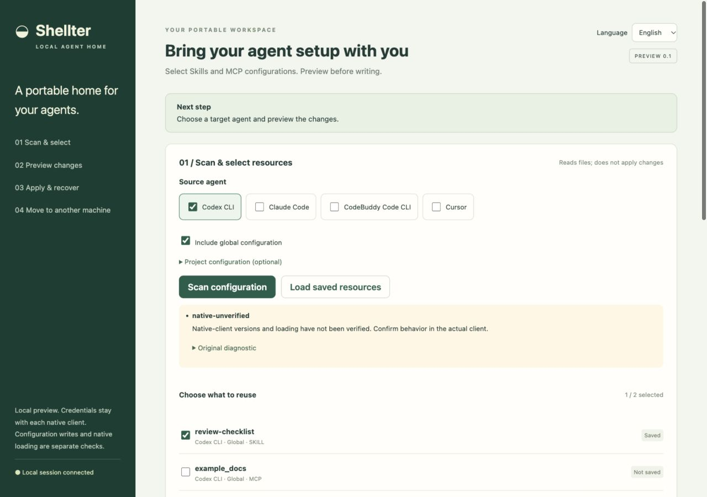
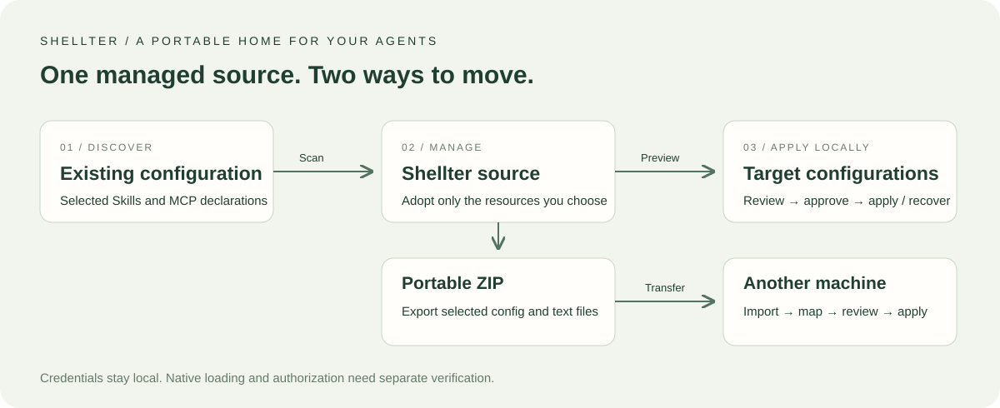

# Shellter

[](https://github.com/Legimity/shellter/actions/workflows/ci.yml)

**A portable home for your AI coding agents.**

[Download](https://github.com/Legimity/shellter/releases/latest) · [Quick start](#quick-start) · [简体中文](README.zh-CN.md) · [Report an issue](https://github.com/Legimity/shellter/issues)

Keep the Skills and MCP configurations you've already set up when you switch coding agents or machines. Shellter gives you a local web interface and CLI to select resources, review changes, move them in a ZIP, and recover configuration writes.



## Bring your setup with you

- **Switch agents:** reuse selected Skills without copying folders by hand.
- **Move machines:** export a configuration ZIP, transfer it your way, and map paths on the destination.
- **Review before writing:** inspect target files and before/after content; resolve conflicts explicitly.
- **Undo a configuration change:** recover recorded writes without silently discarding later edits.
- **Keep credentials local:** transfer configuration and references, then use the target client's own authentication.

Configuration adapters cover Codex CLI, Claude Code, CodeBuddy Code CLI and Cursor. See [per-client compatibility](docs/COMPATIBILITY.md) for verified versions and resource types.



## Quick start

Requires **Node.js 24** and npm. Try a temporary example first; no API key or installed coding agent is needed.

```bash
git clone https://github.com/Legimity/shellter.git
cd shellter
npm ci
npm run demo
```

Open the localhost link printed in your terminal. Select the example Skill, preview its destination, apply it, then recover the change. The [first-run guide](docs/GETTING-STARTED.md) walks through each click. The interface supports English and Simplified Chinese.

Prefer a prebuilt download? Get **`shellter-0.1.0-node24.zip`** from [Releases](https://github.com/Legimity/shellter/releases/latest), extract it, run `npm ci --omit=dev` inside its folder, then `npm run demo`. No source build is needed.

When you're ready to use your own configurations, stop the demo and run `npm start`. Choose the source, target and resources in the interface. See the [CLI guide](docs/CLI.md) for headless use and custom profiles.

## Tested on a real move

A macOS → Ubuntu migration moved **47 Skills / 112 files** to both tclaude and CodeBuddy. Each client successfully invoked one migrated Skill; tclaude discovered all 47. A separate cross-machine MCP fixture passed native invocation and recovery. [Read the evidence and scope](docs/REMOTE-MIGRATION.md).

## Docs and community

- [First-run guide](docs/GETTING-STARTED.md) · [CLI](docs/CLI.md) · [Demo](docs/DEMO.md)
- [Compatibility](docs/COMPATIBILITY.md) · [Release notes](docs/RELEASE-NOTES.md)
- [Contributing](CONTRIBUTING.md) · [Development](docs/DEVELOPMENT.md) · [Security](SECURITY.md)

Using Shellter on a different client version or machine? [Share a reproducible result](https://github.com/Legimity/shellter/issues/new/choose) to help improve compatibility.

[MIT licensed](LICENSE). Bundled dependencies retain their [third-party notices](THIRD-PARTY-NOTICES.txt).
