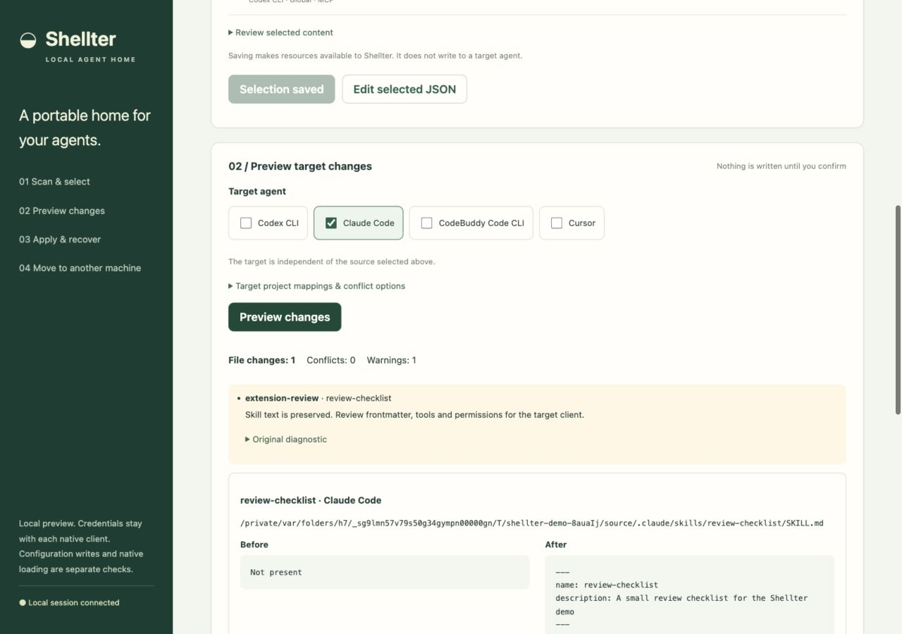
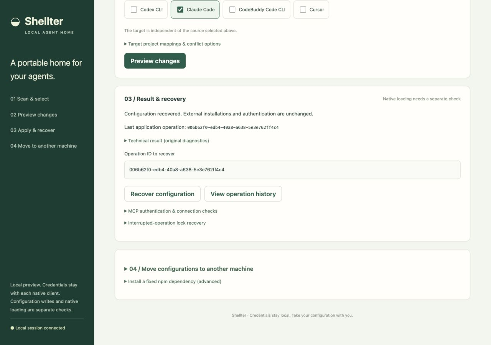
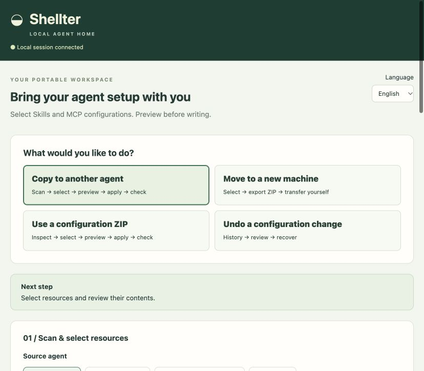
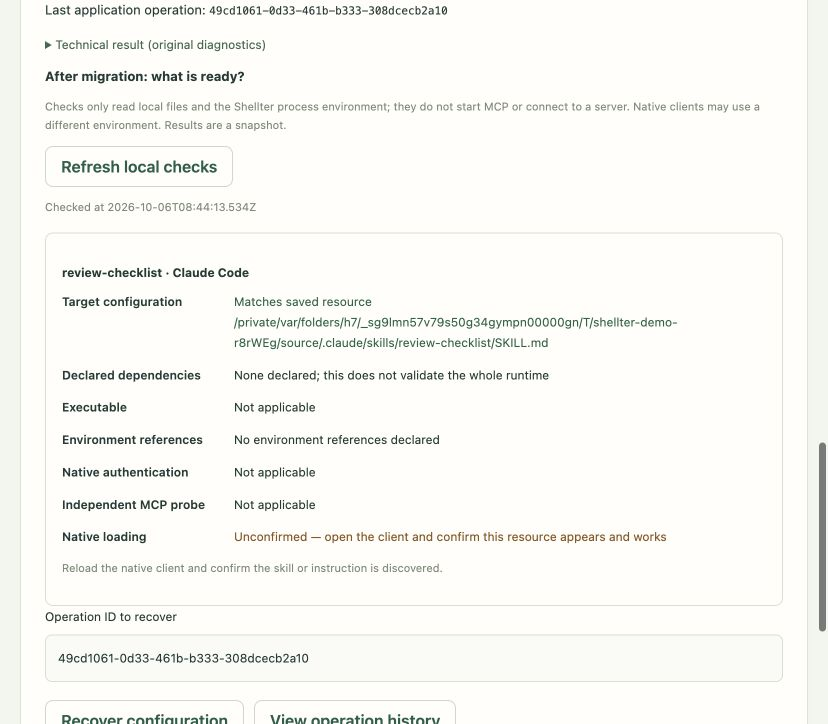

# Try Shellter with example configurations

[English README](../README.md) · [Simplified Chinese](../README.zh-CN.md)

This walkthrough uses temporary configuration files. It demonstrates config selection, a reviewed write, and recovery. It does not demonstrate native Claude/Codex loading, OAuth, or a live MCP connection. Choose English in the top-right Language selector. The interface also supports Simplified Chinese and remembers your choice.

## Before starting

Use Node.js 24 and npm. Open the repository directory and run:

```bash
npm ci
npm run demo
```

The script builds the current code and prints a fixture directory and one-use localhost URL. Open that URL. Your normal HOME is not used for scanning or configuration writes. Each run creates a fresh fixture directory. Use Ctrl+C to stop the server; temporary fixture files remain for inspection.

## Web walkthrough

1. In **Source agent**, leave **Codex CLI** and **Include global configuration** selected. Click **Scan configuration**.
2. Select only **review-checklist**, the example Skill. Leave **example_docs** unselected; its URL is intentionally non-live.
3. Open **Review selected content**, then click **Save selected resources**. Saving does not modify target files.
4. In the separate **Target agent** section, keep **Claude Code** selected.
5. Click **Preview changes**. Expect one file change, no conflict, and a cross-agent review warning. Read the target path and **Before** / **After** contents.
6. Click **Apply reviewed changes**, then **Confirm** in the page dialog. Expect a configuration-applied result. Confirm native loading separately; this example does not run Claude.
7. Click **Recover configuration**, then **Confirm**. Expect a configuration-recovered result. The operation ID is filled automatically.



The screenshot is an actual demo plan, including temporary paths. A plan can contain warnings even when it has no blocking conflict. Neither a successful write nor an independent MCP probe proves native loading.



## Reproducible CLI migration

```bash
npm run demo:walkthrough
```

The script invokes the built CLI and checks:

1. Scan the Codex example and select its one Skill.
2. Adopt the selected Skill and export actual content in a ZIP.
3. Import and adopt into a **different temporary HOME**.
4. Generate a Claude plan, apply it, and read back identical Skill content.
5. Recover the operation and confirm the destination no longer contains the managed Skill.

Successful output includes five `PASS` lines. The run exits nonzero if an assertion or CLI operation fails. It requires no network after dependencies have been installed. No native agent, OAuth flow, MCP program, or model runs in this walkthrough.

## Move on to your own configuration

Stop the demo. Run `npm start` from the built repository to use your own HOME, or pass explicit `--home` and `--state` paths through the CLI. Scan only the scopes you intend to manage. Use the [compatibility and limitations](COMPATIBILITY.md) before relying on a native client.

The demo applies global fixtures. Project migration requires an explicit existing project directory mapping; absolute launch arguments must be classified as paths or literal data. See the [CLI guide](CLI.md).

## Task guidance and migration checklist

Choose a task at the top of the page: copy to another agent, export for a new machine, inspect a ZIP on the destination, or recover configuration writes. After applying, Shellter compares the target configuration and checks local prerequisites. Authentication and native loading still require confirmation in the target client. Read the [first-session guide](GETTING-STARTED.md) for the exact steps.




